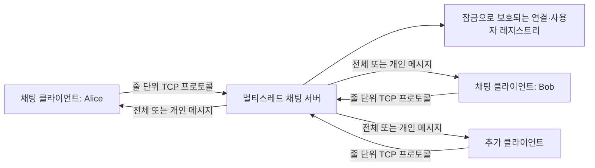
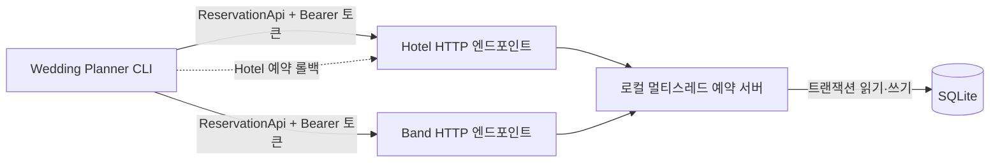

# 복원형 분산 시스템 실습

[English README](README.md)

기존 수업용 API와 런타임 라이브러리가 사라진 뒤에도 독립적으로 실행할 수 있도록 복구하고 현대화한 두 개의 네트워크 애플리케이션입니다. Python으로 동시 TCP 메시징, HTTP 예약 서비스, 영속 상태, 충돌 처리, 보상 트랜잭션을 구현합니다.

## 프로젝트 배경

두 애플리케이션은 University of Manchester 분산 컴퓨팅 수업 과제에서 시작했습니다. 제출물에 포함되지 않았던 채팅 런타임을 더 이상 사용할 수 없었고, 원격 호텔·밴드 서비스도 응답하지 않게 되었습니다. 원래 사용자 프로토콜은 유지하면서 이러한 의존성을 자체 구현으로 교체했습니다.

이 저장소는 과제 원본을 그대로 게시한 것이 아니라, 레거시 분산 시스템 실습을 재현 가능하고 테스트 가능하며 로컬에서 안전하게 실행할 수 있도록 복구·리팩터링한 프로젝트입니다.

## 핵심 구현

| 영역 | 구현 내용 |
|---|---|
| 동시 메시징 | 연결마다 독립 스레드를 사용하는 TCP 서버와 동기화된 공유 상태 |
| 텍스트 프로토콜 | 등록, 전체 메시지, 개인 메시지, 사용자 조회, 정상 종료 |
| HTTP 서비스 | 기존 클라이언트 계약과 호환되는 로컬 Hotel/Band API |
| 영속성 | 스키마 및 슬롯을 자동 생성하는 SQLite 예약 저장소 |
| 충돌 제어 | 트랜잭션과 유일성 제약으로 이중 예약 방지 |
| 장애 복구 | Band 예약 실패 시 앞서 생성한 Hotel 예약을 해제하는 보상 처리 |
| 회복성 | timeout, 제한적 재시도, 상태 코드별 예외, 매번 최신 상태 조회 |
| 검증 | 실제 TCP·HTTP 소켓을 사용하는 자동 통합 테스트 |

## 아키텍처

### Talk



각 연결은 독립적인 서버 스레드가 처리합니다. 재진입 잠금이 등록 및 연결 상태를 보호하며, 각 클라이언트 핸들러는 해당 소켓 쓰기를 직렬화합니다.

### Hotel Wedding Planner



Hotel과 Band는 하나의 로컬 HTTP 프로세스가 제공하는 독립 리소스입니다. SQLite가 데이터를 영속화하고 경쟁 쓰기를 직렬화합니다. 두 리소스가 하나의 원자적 트랜잭션을 공유한다고 가정하지 않고, CLI가 보상 작업으로 두 예약을 조정합니다.

## 저장소 구조

```text
Distributed-System/
├── Hotel/
│   ├── api.ini             # 로컬 API, 토큰, 재시도, DB 설정
│   ├── booking.py          # Wedding Planner CLI
│   ├── exceptions.py       # 상태 코드별 클라이언트 예외
│   ├── local_api.py        # 멀티스레드 Hotel/Band HTTP 서비스
│   └── reservationapi.py   # 재시도 기능이 있는 HTTP 클라이언트
├── Talk/
│   ├── commands.json       # 채팅 프로토콜 예제
│   ├── myclient.py         # 대화형 TCP 채팅 클라이언트
│   └── myserver.py         # 동시 TCP 채팅 서버
├── tests/
│   ├── test_hotel.py       # HTTP 및 Planner 통합 테스트
│   └── test_talk.py        # TCP 프로토콜 통합 테스트
├── .github/workflows/ci.yml # 교차 플랫폼 지속적 통합
├── requirements-dev.txt
├── requirements.txt
└── README.md               # 영문 메인 문서
```

## 요구 사항

- Python 3.10 이상
- Talk용 로컬 TCP 포트 `8090`
- Hotel용 로컬 HTTP 포트 `8081`

## 설치

저장소 루트에서 가상 환경을 만들고 의존성을 설치합니다.

### Windows PowerShell

```powershell
python -m venv .venv
.\.venv\Scripts\Activate.ps1
python -m pip install --upgrade pip
python -m pip install -r requirements.txt
```

PowerShell 실행 정책으로 활성화가 막히면 가상 환경의 Python을 직접 사용합니다.

```powershell
.\.venv\Scripts\python.exe -m pip install -r requirements.txt
```

### macOS/Linux

```bash
python3 -m venv .venv
source .venv/bin/activate
python -m pip install --upgrade pip
python -m pip install -r requirements.txt
```

## Talk 실행

첫 번째 터미널에서 서버를 실행합니다.

```powershell
python .\Talk\myserver.py
```

두 번째 터미널에서 클라이언트를 실행합니다.

```powershell
python .\Talk\myclient.py
```

다중 사용자를 확인하려면 다른 터미널에서 같은 클라이언트 명령을 한 번 더 실행합니다. 기본 주소는 `127.0.0.1:8090`입니다. 다른 주소는 두 프로그램에 함께 전달합니다.

```powershell
python .\Talk\myserver.py 0.0.0.0 9000
python .\Talk\myclient.py 127.0.0.1 9000
```

`0.0.0.0`으로 서버를 열면 운영체제 방화벽이 해당 포트를 허용하는 경우 LAN의 다른 장치도 접속할 수 있습니다.

### Talk 프로토콜

고유한 화면 이름을 입력한 뒤 다음 명령을 사용합니다.

| 명령 | 기능 | 예시 |
|---|---|---|
| `send_all <message>` | 등록된 모든 사용자에게 전송 | `send_all Hello everyone` |
| `send_to <user> <message>` | 특정 사용자에게 전송 | `send_to Bob Hello Bob` |
| `user_list` | 등록 사용자 목록 조회 | `user_list` |
| `quit` | 서버 확인 후 연결 종료 | `quit` |

화면 이름에는 공백을 사용할 수 없으며 접속 중인 두 클라이언트가 같은 이름을 등록할 수 없습니다.

## Hotel 실행

Hotel은 로컬 예약 API와 Wedding Planner 클라이언트를 각각 실행합니다.

### 1. 예약 API 실행

첫 번째 터미널에서 실행합니다.

```powershell
python .\Hotel\local_api.py
```

기본 실행 환경은 다음과 같습니다.

- API 서버: `http://127.0.0.1:8081`
- Hotel 슬롯: 1~100
- Band 슬롯: 1~100
- 영속 데이터베이스: `Hotel/data/reservations.db`

예약은 서버를 재시작해도 유지됩니다. 서버를 종료한 상태에서 다음 명령으로 데이터를 초기화할 수 있습니다.

```powershell
python .\Hotel\local_api.py --reset-data
```

호스트, 포트, 데이터베이스 경로, 최초 슬롯 개수도 변경할 수 있습니다.

```powershell
python .\Hotel\local_api.py --port 9001 --database .\Hotel\data\demo.db --slots 250
```

포트를 변경했다면 `Hotel/api.ini`의 두 서비스 URL도 같은 포트로 수정해야 합니다.

### 2. Wedding Planner 실행

두 번째 터미널에서 실행합니다.

```powershell
python .\Hotel\booking.py
```

메뉴 기능은 다음과 같습니다.

1. Hotel/Band의 현재 예약 조회
2. 예약 가능한 슬롯 조회
3. 한 서비스 수동 예약
4. 예약 취소
5. 두 서비스에서 모두 가능한 슬롯 조회
6. 가장 빠른 Hotel/Band 공통 슬롯 예약
7. 중복되거나 불필요한 예약 정리

빠르게 확인하려면 새 데이터베이스에서 메뉴 `6`을 선택한 뒤 `1`을 선택합니다. Hotel과 Band 양쪽에 슬롯 `1`이 표시되어야 합니다.

### 로컬 토큰

`Hotel/api.ini`에는 서비스별로 두 개의 데모 사용자가 들어 있습니다. 실제 비밀 키가 아닌 로컬 테스트 데이터입니다. 환경변수로 현재 클라이언트 사용자를 바꿀 수 있습니다.

```powershell
$env:HOTEL_API_KEY = "hotel-demo-user-2"
$env:BAND_API_KEY = "band-demo-user-2"
python .\Hotel\booking.py
```

실제 자격 증명은 환경변수나 비밀 관리 도구에 저장하고 Git에 커밋하지 마십시오.

## Hotel HTTP 계약

모든 요청에는 `Authorization: Bearer <token>` 헤더가 필요합니다.

| Method | Endpoint | 동작 |
|---|---|---|
| `GET` | `/{service}/api/reservation/available` | 예약 가능한 슬롯 조회 |
| `GET` | `/{service}/api/reservation` | 현재 토큰이 보유한 슬롯 조회 |
| `POST` | `/{service}/api/reservation/{id}` | 슬롯 예약 |
| `DELETE` | `/{service}/api/reservation/{id}` | 슬롯 해제 |

`service`는 `hotel` 또는 `band`입니다.

| 상태 코드 | 의미 |
|---|---|
| `400` | 잘못된 요청 또는 슬롯 ID |
| `401` | 누락되었거나 잘못된 토큰 |
| `403` | 존재하지 않는 슬롯 |
| `404` | 현재 토큰이 보유하지 않은 예약 |
| `409` | 다른 토큰이 이미 보유한 슬롯 |
| `451` | 예약 2개 제한 초과 |

## 신뢰성과 일관성 설계

- **제한된 장애 시간:** HTTP 요청에 명시적 timeout과 횟수가 제한된 점진적 재시도를 사용합니다.
- **오래된 캐시 제거:** 모든 예약 작업이 서비스에서 최신 상태를 다시 조회합니다.
- **쓰기 직렬화:** SQLite `BEGIN IMMEDIATE`가 경쟁 예약 쓰기를 직렬화합니다.
- **DB 불변 조건:** `(service, slot_id)`가 예약 기본 키이므로 한 슬롯을 이중 예약할 수 없습니다.
- **보상 트랜잭션:** Hotel 성공 후 Band가 실패하면 새 Hotel 예약을 해제합니다.
- **스레드 안전성:** Talk의 공유 클라이언트 레지스트리와 소켓 쓰기를 잠금으로 보호합니다.
- **정상 프로토콜 종료:** Talk 클라이언트는 서버의 `Client exiting` 응답을 받은 뒤 종료합니다.

## 자동 검증

테스트 전에 서버를 별도로 실행할 필요가 없습니다. 테스트가 임시 포트와 데이터베이스를 자동 할당합니다.

```powershell
python -m unittest discover -s tests -v
```

통합 테스트 범위는 다음과 같습니다.

- Hotel/Band 가용 슬롯, 예약, 해제, 서비스 격리
- 잘못된 인증 및 사용자별 예약 한도
- 두 사용자가 같은 슬롯을 요청할 때의 충돌
- 가장 빠른 Hotel/Band 공통 슬롯 자동 예약
- Talk 등록, 전체/개인 메시지, 사용자 목록, 종료
- 잘못된 명령과 미등록 사용자 처리

개발 중 사용한 정적 검사는 다음과 같습니다.

```powershell
python -m pip install -r requirements-dev.txt
ruff check Hotel Talk tests
ruff format --check Hotel Talk tests
```

`ruff`는 개발 도구이며 애플리케이션 실행에는 필요하지 않습니다. GitHub Actions가 push 및 pull request마다 Windows와 Ubuntu, Python 3.10과 3.12 조합에서 정적 검사와 통합 테스트를 반복합니다.

## 트레이드오프와 향후 개선

- 데모 인증은 프로토콜 검증용이며 인터넷 공개 서비스에는 적합하지 않습니다.
- SQLite는 로컬 복구 목적에는 적합하지만 다중 노드 배포에는 공유 DB 또는 합의를 고려한 저장소가 필요합니다.
- 서비스 간 예약은 보상 방식을 사용하므로 롤백 요청도 실패하는 상황에서는 엄격한 원자성을 보장하지 못합니다.
- 채팅 기록은 메모리에만 존재합니다. 영속 기록에는 DB 및 전달 확인 모델이 필요합니다.
- 공개 배포 전 TLS, 요청 제한, 구조화 로그, 관측성을 추가해야 합니다.

## 문제 해결

### 포트를 이미 사용 중인 경우

기존 서버를 `Ctrl+C`로 종료하거나 서버와 클라이언트 양쪽에 다른 포트를 지정합니다.

### Wedding Planner가 연결되지 않는 경우

`Hotel/local_api.py`를 먼저 실행하고 서버가 출력한 포트와 `Hotel/api.ini`의 두 URL이 일치하는지 확인합니다.

### 예약 데이터 초기화

API를 종료하고 `--reset-data`로 다시 시작합니다. 설정된 SQLite 예약 데이터베이스를 새로 생성합니다.

## 출처 표기

최초 애플리케이션 요구사항과 프로토콜은 University of Manchester 분산 컴퓨팅 수업 과제에서 시작했습니다. 이 저장소의 독립 TCP 런타임, 로컬 예약 API, SQLite 영속성, 회복성 개선, 통합 테스트 및 문서는 이후 진행한 복구·리팩터링 작업입니다.
