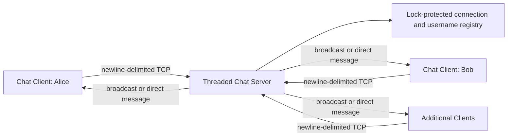
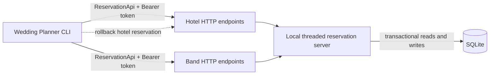

# Resilient Distributed Systems Lab

[English](README.md) | [한국어](README.ko.md)

Two networked applications restored and modernized after their original course APIs and runtime library became unavailable. The repository demonstrates concurrent TCP messaging, an HTTP reservation service, persistent state, conflict handling, and compensating transactions using Python.

## Why This Project Exists

These applications began as University of Manchester distributed-computing coursework. The original chat runtime was no longer bundled with the submission, and the remote hotel and band services stopped responding. The recovery work replaced those dependencies with self-contained implementations while preserving the original user-facing protocols.

This is not presented as untouched coursework. It is a recovery and refactoring project focused on making legacy distributed-system exercises reproducible, testable, and safe to run locally.

## Project Highlights

| Area | Implementation |
|---|---|
| Concurrent messaging | Thread-per-connection TCP server with synchronized shared state |
| Text protocol | Registration, broadcast, direct messaging, user discovery, and graceful disconnect |
| HTTP services | Local Hotel and Band API compatible with the original client contract |
| Persistence | SQLite reservation store with automatic schema and slot initialization |
| Conflict control | Database transaction and unique constraint prevent double booking |
| Failure recovery | Hotel reservations are compensated when the matching Band reservation fails |
| Resilience | Request timeouts, bounded retries, status-specific exceptions, and live state reads |
| Verification | Automated integration tests exercise both systems over real TCP and HTTP sockets |

## Architecture

### Talk



Every connection is handled by an independent server thread. A re-entrant lock protects registration and connection state, while each client handler serializes writes to its socket.

### Hotel Wedding Planner



Hotel and Band are separate resources exposed by one local HTTP process. SQLite provides persistent state and serializes competing writes. The CLI coordinates the two independent resources with a compensating action rather than pretending they share one atomic transaction.

## Repository Layout

```text
Distributed-System/
├── Hotel/
│   ├── api.ini             # Local API, tokens, retries, and database settings
│   ├── booking.py          # Interactive Wedding Planner
│   ├── exceptions.py       # Status-specific client exceptions
│   ├── local_api.py        # Threaded Hotel/Band HTTP service
│   └── reservationapi.py   # Retrying HTTP client
├── Talk/
│   ├── commands.json       # Chat protocol examples
│   ├── myclient.py         # Interactive TCP chat client
│   └── myserver.py         # Concurrent TCP chat server
├── tests/
│   ├── test_hotel.py       # HTTP and planner integration tests
│   └── test_talk.py        # TCP protocol integration tests
├── .github/workflows/ci.yml # Cross-platform continuous integration
├── requirements-dev.txt
├── requirements.txt
└── README.ko.md
```

## Requirements

- Python 3.10 or newer
- Local TCP port `8090` for Talk
- Local HTTP port `8081` for Hotel

## Installation

Clone the repository, create a virtual environment, and install the single runtime dependency.

### Windows PowerShell

```powershell
python -m venv .venv
.\.venv\Scripts\Activate.ps1
python -m pip install --upgrade pip
python -m pip install -r requirements.txt
```

If PowerShell prevents environment activation, call its interpreter directly:

```powershell
.\.venv\Scripts\python.exe -m pip install -r requirements.txt
```

### macOS/Linux

```bash
python3 -m venv .venv
source .venv/bin/activate
python -m pip install --upgrade pip
python -m pip install -r requirements.txt
```

## Running Talk

Start the server in the first terminal:

```powershell
python .\Talk\myserver.py
```

Start a client in a second terminal:

```powershell
python .\Talk\myclient.py
```

Open another terminal and run the same client command to test multi-user behavior. The default endpoint is `127.0.0.1:8090`. A custom address can be passed to both programs:

```powershell
python .\Talk\myserver.py 0.0.0.0 9000
python .\Talk\myclient.py 127.0.0.1 9000
```

Opening the server on `0.0.0.0` permits LAN connections when the operating-system firewall also allows the selected port.

### Talk Protocol

After entering a unique screen name, use these commands:

| Command | Purpose | Example |
|---|---|---|
| `send_all <message>` | Send to every registered user | `send_all Hello everyone` |
| `send_to <user> <message>` | Send to one user | `send_to Bob Hello Bob` |
| `user_list` | List registered users | `user_list` |
| `quit` | Disconnect after server confirmation | `quit` |

Screen names cannot contain whitespace and cannot be registered by two connected clients at the same time.

## Running Hotel

Hotel uses two processes: the local reservation API and the Wedding Planner client.

### 1. Start the Reservation API

In the first terminal:

```powershell
python .\Hotel\local_api.py
```

The default setup creates:

- API server at `http://127.0.0.1:8081`
- Hotel slots `1` through `100`
- Band slots `1` through `100`
- Persistent database at `Hotel/data/reservations.db`

Reservations survive server restarts. To reset the local data safely while the server is stopped:

```powershell
python .\Hotel\local_api.py --reset-data
```

The host, port, database path, and initial slot count can be overridden:

```powershell
python .\Hotel\local_api.py --port 9001 --database .\Hotel\data\demo.db --slots 250
```

When changing the port, update both service URLs in `Hotel/api.ini` as well.

### 2. Start the Wedding Planner

In the second terminal:

```powershell
python .\Hotel\booking.py
```

The menu supports:

1. Viewing current Hotel and Band reservations
2. Viewing available slots
3. Reserving either service manually
4. Cancelling a reservation
5. Finding slots available from both services
6. Reserving the earliest matching Hotel and Band slot
7. Removing duplicate or unnecessary reservations

For a quick demonstration, select option `6`, then option `1`. A fresh database should show slot `1` held for both Hotel and Band.

### Local Tokens

`Hotel/api.ini` contains two demo identities per service. These values are local fixtures, not production secrets. The active client identity can be overridden with environment variables:

```powershell
$env:HOTEL_API_KEY = "hotel-demo-user-2"
$env:BAND_API_KEY = "band-demo-user-2"
python .\Hotel\booking.py
```

Use environment variables or a secret manager for real credentials. Never commit production tokens.

## Hotel HTTP Contract

Every request requires `Authorization: Bearer <token>`.

| Method | Endpoint | Behavior |
|---|---|---|
| `GET` | `/{service}/api/reservation/available` | List unreserved slots |
| `GET` | `/{service}/api/reservation` | List slots held by the current token |
| `POST` | `/{service}/api/reservation/{id}` | Reserve a slot |
| `DELETE` | `/{service}/api/reservation/{id}` | Release a slot |

`service` is either `hotel` or `band`.

| Status | Meaning |
|---|---|
| `400` | Malformed request or slot ID |
| `401` | Missing or invalid token |
| `403` | Slot does not exist |
| `404` | Reservation is not held by this token |
| `409` | Slot is already held by another token |
| `451` | Two-reservation limit exceeded |

## Reliability and Consistency Decisions

- **Bounded failure:** HTTP calls use explicit timeouts and finite retries with incremental delay.
- **No stale client cache:** reservation views are fetched from the service for every operation.
- **Write serialization:** `BEGIN IMMEDIATE` serializes competing SQLite reservations.
- **Database invariant:** `(service, slot_id)` is the reservation primary key, so a slot cannot be double-booked.
- **Compensation:** if Hotel succeeds and Band fails, the new Hotel reservation is released.
- **Thread safety:** Talk protects its shared client registry and per-socket writes with locks.
- **Graceful protocol shutdown:** a Talk client exits only after receiving `Client exiting` from the server.

## Automated Verification

No servers need to be running before the test command. Tests allocate temporary ports and databases automatically.

```powershell
python -m unittest discover -s tests -v
```

The integration suite verifies:

- Hotel and Band availability, reservation, release, and isolation
- Invalid authentication and per-user reservation limits
- Conflict behavior when two users request the same slot
- Automatic reservation of the earliest matching Hotel/Band slot
- Talk registration, broadcast, direct messaging, user listing, and shutdown
- Invalid commands and registration enforcement

Static checks used during development:

```powershell
python -m pip install -r requirements-dev.txt
ruff check Hotel Talk tests
ruff format --check Hotel Talk tests
```

`ruff` is a development tool and is not required to run either application. GitHub Actions repeats the static checks and integration suite on Windows and Ubuntu with Python 3.10 and 3.12 for every push and pull request.

## Trade-offs and Future Work

- Demo authentication proves protocol behavior but is not suitable for an internet-facing deployment.
- SQLite is appropriate for this local recovery; a multi-node deployment would require a shared database or consensus-aware storage design.
- The cross-service booking flow uses compensation and therefore cannot guarantee strict atomicity if the rollback request also fails.
- Chat history exists only in memory. Durable history would require a database and a delivery/acknowledgement model.
- TLS, rate limiting, structured logging, and observability should be added before public deployment.

## Troubleshooting

### Address already in use

Stop the previous server with `Ctrl+C`, or provide another port to both the server and client.

### Wedding Planner cannot connect

Start `Hotel/local_api.py` first and confirm that the port printed by the server matches both URLs in `Hotel/api.ini`.

### Resetting reservations

Stop the API and start it with `--reset-data`. This recreates the configured SQLite reservation database.

## Attribution

The initial application requirements and protocols originated in University of Manchester distributed-computing coursework. The self-contained TCP runtime, local reservation API, SQLite persistence, resilience improvements, integration tests, and documentation in this repository are part of the subsequent recovery and refactoring work.
